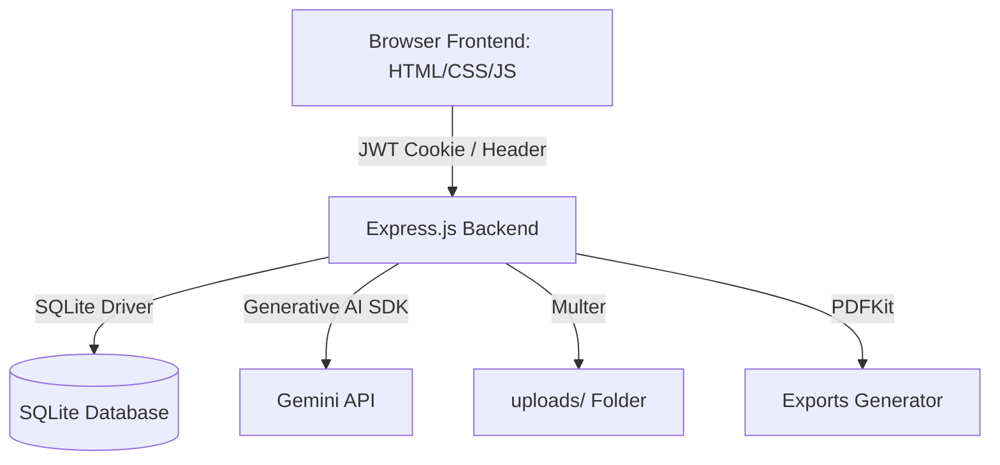

# Implementation Plan - FutureMe OS AI Career Operating System

This document outlines the architecture, database design, API design, AI integration strategy, and frontend modifications required to build **FutureMe OS**, a production-ready AI-powered career development system.

---

## Technical Architecture

---

## User Review Required

> [!IMPORTANT]
> - **Authentication Flow**: We will secure pages (`app.html` and `onboarding.html`) via a client-side JWT token check that validates with `/api/auth/me`. If unauthorized, it redirects to `/index.html`. This keeps routing clean and fast.
> - **Gemini AI Call Limits**: Since onboarding requires generating a roadmap, 30/90/365 plans, daily routines, 4 projects, and resumes, we will divide these tasks into 3 distinct, parallelizable requests to the Gemini API to prevent timeout issues and token overflow. This ensures we stay within safety limits while providing rapid load times (approx. 4-6 seconds, within the onboarding screen's loader animation duration).

---

## Open Questions

> [!NOTE]
> None at the moment. We have a clear specification of the required folders, database schema, AI output formats, and UI integration.

---

## Proposed Changes

### Component 1: Project Setup & Package Configurations

#### [NEW] [package.json](file:///d:/NC/FutureME%20AI/package.json)
Contains core dependencies: `express`, `cors`, `dotenv`, `jsonwebtoken`, `bcryptjs`, `sqlite3`, `sqlite` (async SQLite wrapper), `multer` (for resume file uploads), `pdfkit` (for PDF exports), and `@google/generative-ai` (Gemini API SDK).

#### [NEW] [.env.example](file:///d:/NC/FutureME%20AI/.env.example)
Example environment variables: `PORT`, `JWT_SECRET`, `GEMINI_API_KEY`, `DB_FILE`.

#### [NEW] [server.js](file:///d:/NC/FutureME%20AI/server.js)
The main server entry point. Serves static files from the `/public` directory, registers API routes, and configures global error handlers.

---

### Component 2: Folder Structuring

We will move the current frontend assets to a `/public` folder to keep the root directory professional.

- `index.html` → `public/index.html`
- `onboarding.html` → `public/onboarding.html`
- `app.html` → `public/app.html`
- `css/` → `public/css/`
- `js/` → `public/js/`

We will create the backend structure as specified:
- `config/`
- `database/`
- `routes/`
- `controllers/`
- `middleware/`
- `services/`
- `prompts/`
- `uploads/`
- `utils/`

---

### Component 3: Database & Auth System

#### [NEW] [db.js](file:///d:/NC/FutureME%20AI/config/db.js)
Handles connection and runs queries using async/await.

#### [NEW] [init.js](file:///d:/NC/FutureME%20AI/database/init.js)
Initializes normalized database tables:
- **`users`**: Auth credentials.
- **`profiles`**: Collected onboarding information.
- **`goals`**: Active career and development goals.
- **`skills` & `skill_progress`**: Tracks current/weak skills and their capability telemetry.
- **`weekly_plans` & `daily_tasks`**: Manages operational sprints and schedules.
- **`roadmaps`**: Holds the JSON roadmap generated by Gemini.
- **`projects`**: Holds generated beginner, intermediate, advanced, and flagship projects.
- **`reports`**: History of generated weekly/monthly plans and profiles.
- **`future_letters`**: Stored letters from the user's future self.
- **`achievements`**: Unlocked career and platform accomplishments.
- **`mentor_conversations`**: Chat transcript history.
- **`settings`**: UI theme and preferences.
- **`history`**: Audit logs of user actions.

#### [NEW] [auth.js](file:///d:/NC/FutureME%20AI/middleware/auth.js)
Middleware validating the JWT token from HTTP headers (Bearer token) or Cookies, injecting user context into requests.

---

### Component 4: AI Engine Service & Templates

#### [NEW] [templates.js](file:///d:/NC/FutureME%20AI/prompts/templates.js)
Stores structured system prompts prompting Gemini to output strict JSON schemas for:
1. **Core Career Roadmap & Routine**: Analyzes gaps, structures 30/90/365-day schedules.
2. **Project Builder**: Designs 4 curated projects with folder structures, architectures, and resume bullets.
3. **LinkedIn & Resume Audit**: Suggests wording edits, headlines, and networking strategy.
4. **Mentor Response**: Context-aware guidance incorporating user progress.
5. **Future Letter**: Dynamic self-reflection letters based on actual monthly milestone completion.

#### [NEW] [gemini.js](file:///d:/NC/FutureME%20AI/services/gemini.js)
AI Service wrapper communicating with Gemini. Parses and cleans JSON output, handling retry limits and custom timeouts.

---

### Component 5: API Controllers and Endpoints

We will create REST routes for the frontend application.

- **`/api/auth`**:
  - `POST /signup`: Hashes passwords and creates user.
  - `POST /login`: Validates password and issues JWT.
  - `GET /me`: Returns logged-in user and onboarding state.
- **`/api/profile`**:
  - `POST /setup`: Uploads resume (multer) and triggers parallel Gemini services to initialize all dashboard content.
  - `GET /dashboard`: Fetches consolidated roadmap, projects, skills, and routines for dashboard views.
- **`/api/tasks`**:
  - `GET /daily`: Gets today's tasks.
  - `POST /:id/complete`: Marks task complete (triggers XP and progress updates).
  - `POST /:id/skip` / `POST /:id/postpone`: Handles task exceptions.
  - `POST /weekly-checkin`: Accountability checkpoint asking "Did you complete your goals?". Recalculates roadmap or adjusts task difficulties depending on Yes/No/Partial.
- **`/api/mentor`**:
  - `GET /chat`: Gets conversation history.
  - `POST /chat`: Appends message and generates context-aware response.
- **`/api/letters`**:
  - `GET /all`: Fetches past self-letters.
  - `POST /generate`: Forces a monthly letter generation reflecting task progress.
- **`/api/export`**:
  - `GET /pdf` / `/markdown` / `/json`: Generates formatted text/reports for download.
- **`/api/history`**:
  - `GET /list`: Fetches historical reports.
  - `GET /compare/:id1/:id2`: Compares metrics of two different states.
- **`/api/settings`**:
  - `POST /update`: Modifies user theme, reminder time, and notifications.

---

### Component 6: Frontend Integration & UX Polish

We will update the HTML/JS to communicate with the REST API:
1. **`index.html`**: Switch form submits to fetch calls, saving the JWT token and loading states.
2. **`onboarding.html`**:
   - Add fields for Expected Salary, Portfolio, Resume File, Learning Style, Current Projects, Confidence Level, and Struggles.
   - Update `onboarding.js` to send form inputs via multi-part upload, showing the user-friendly loading status messages before routing to the dashboard.
3. **`app.html`**:
   - Bind dashboard views to state fetched from backend.
   - Wire task actions (checkboxes) to API, recalculating the progress wheel dynamically.
   - Inject generated project cards, resume bullets, LinkedIn headline, and interview coach questions dynamically.
   - Connect the AI Mentor terminal to chat endpoints.
   - Wire export buttons to backend download endpoints.
   - Render letters dynamically and load history compare grids.

---

## Verification Plan

### Automated Tests
We will verify API health and token authorization using local HTTP requests:
1. `npm test` script (or simple verification script running route checks).
2. Command line integration tests validating database schema constraints and JWT payloads.

### Manual Verification
1. Launch server locally via `npm run dev`.
2. Register a new user, complete onboarding (upload a resume), verify that the loading steps cycle, and confirm that the dashboard populates completely with custom Gemini data.
3. Check off tasks to verify completion percentage update, send message to AI mentor, generate exports, and edit settings parameters.
